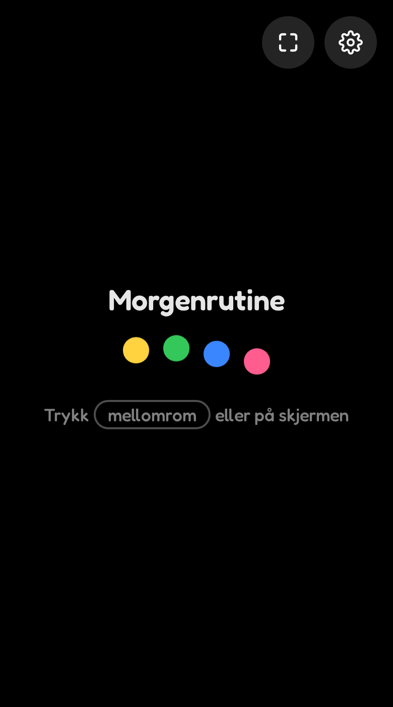
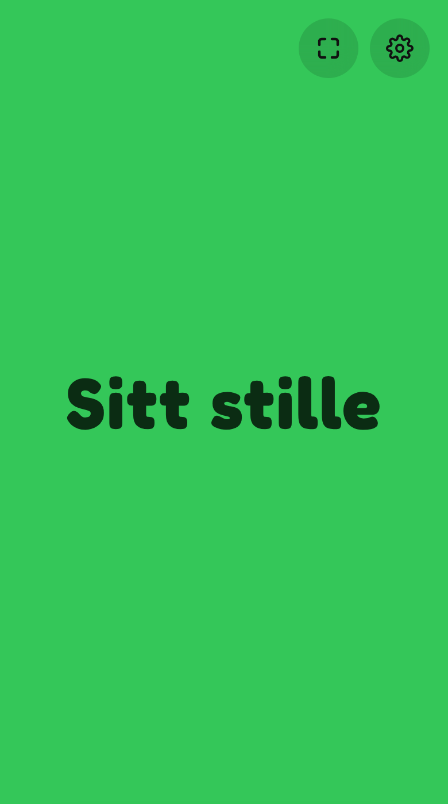
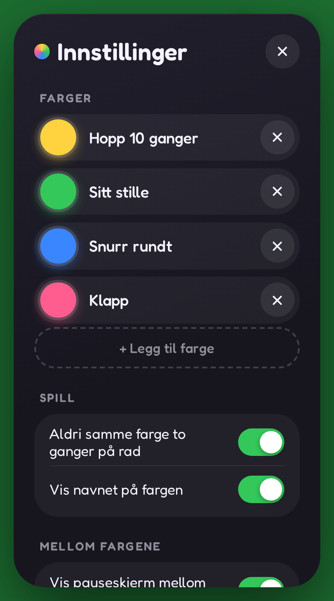

# 🟡🟢🔵 Farger · Colors

A full-screen random color picker for kids' games. Each color stands for an
activity — *yellow = jump ten times, green = sit still, blue = spin around* —
and a tap or a press of **space** reveals the next one.

**▶ [color.apphub.casa](https://color.apphub.casa)**

<p align="center">
  
  &nbsp;
  
  &nbsp;
  
</p>

## How to play

1. Open the page on a TV, tablet or laptop — ideally fullscreen (⛶ button).
2. Open settings (⚙) and give each color an activity, e.g. *Hopp 10 ganger*.
3. Press **space**, **Enter** or tap anywhere — a random color splashes in.
4. Everyone does that color's activity. Repeat!

## Features

- 🎨 **Your colors** — tap a circle to choose from 15 named colors (Rød, Oransje,
  Gul, …) or mix your own with hue and lightness sliders. Name each color with its
  activity, or keep the color's own name. Starts with yellow, green and blue.
- ⏸️ **Pause screen between colors** — optional, back to black (or any color)
  on the next tap, automatically after 1–60 seconds (with a little countdown
  ring), or both — whichever comes first.
- 🔁 **No repeats** — never the same color twice in a row (toggle).
- 🏷️ **Show names** — the color's name in big letters (toggle).
- 🔗 **Share setups** — name a setup ("Morgenrutine") and share it as a link.
  Opening the link loads it on that device, with an undo. Bookmark several links
  to switch between setups.
- 🇳🇴🇬🇧 **Norwegian and English** — follows the browser, or pick one.
- 📺 **Made for a big screen** — fullscreen button, keeps the screen awake, and
  the buttons fade away while you play.
- 🔒 **No accounts, no tracking** — settings live in the browser's
  `localStorage`; share links travel in the URL fragment, which is never sent to
  the server.

## Share links

The **Share setup** button builds a link like:

```
https://color.apphub.casa/#n=Morgenrutine&c=y:Hopp+10,g:Sitt,e63946:Snurr&p=5
```

Everything in the setup is kept. Values at their default are omitted to keep
links short and readable:

| Key | Meaning | Examples |
|-----|---------|----------|
| `n` | Setup name | `n=Morgenrutine` |
| `c` | Colors: a built-in letter (`y`/`g`/`b`) or a 3/6-digit hex, optionally `:name` | `c=y,g,b,f0f` · `c=e63946:Snurr+rundt` |
| `p` | Pause screen: `t` = on tap and/or seconds; optional `:hex` pause color; leading `-` = turned off (details kept) | `p=t` · `p=5` · `p=t5:fff` · `p=-t:fff` |
| `s` | Pause seconds while the timer is off | `s=8` |
| `o` | Options when not both on: `r` = no repeats, `n` = show names | `o=n` · `o=` |
| `l` | Language — always included, so the setup looks the same on every device | `l=no` · `l=en` |

Names are percent-encoded with `+` for spaces. Unknown keys and malformed parts
are ignored, so links keep working as the format grows.

## Development

It's a single file — [`public/index.html`](public/index.html) — with no build step
and no dependencies. Open it directly in a browser, or run:

```sh
npx wrangler dev
```

## Deploy

Served as a Cloudflare Worker with static assets, with `color.apphub.casa` as a
custom domain (see [`wrangler.jsonc`](wrangler.jsonc)):

```sh
npx wrangler deploy
```
